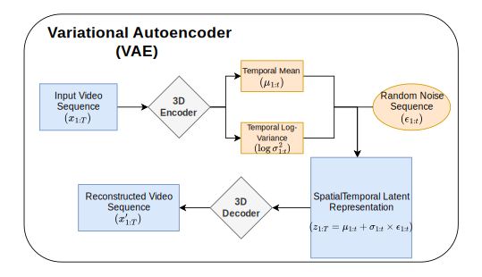

# 🎬 Multimodal Video Generation Models with Audio: Present and Future

[](https://arxiv.org)
[](https://awesome.re)
[](https://opensource.org/licenses/MIT)

> **Abstract:** Video generation models have advanced rapidly and are now widely used across entertainment, advertising, filmmaking, and robotics applications such as world modeling and simulation. However, visual content alone is often insufficient for realistic and engaging media experiences—audio is a key component of immersion and semantic coherence. As AI-generated videos become increasingly prevalent in everyday content, demand has grown for systems that can generate synchronized sound alongside visuals. This trend has driven rising interest in **multimodal video generation**, which jointly models video and audio to produce more complete, coherent, and appealing outputs.

---

## 📖 Table of Contents

- [📚 Citation](#-citation)
- [✨ Representative Models](#-representative-models)
- [🏗️ Architectures & Evolution](#-architectures--evolution)
  - [VAE & Diffusion Foundations](#vae--diffusion-foundations)
  - [The Shift to DiT & Native Multimodality](#the-shift-to-dit--native-multimodality)
- [⚙️ Post-Training & Alignment](#-post-training--alignment)
- [📊 Evaluation](#-evaluation)
- [🚀 Applications & Research Directions](#-applications--research-directions)

---

## 📚 Citation

If you find this survey useful for your research, please cite our work:

```bibtex
@article{author2025multimodal,
  title={Multimodal Video Generation Models with Audio: Present and Future},
  author={Author, First A. and Author, Second B. and Author, Third C.},
  journal={IEEE Access},
  year={2025},
  doi={10.1109/ACCESS.2017.DOI}
}
```

## ✨ Representative Models

A summary of current state-of-the-art multimodal video diffusion models discussed in our survey.

| Model / System              | Architecture             | Key Features                                   | Release   |
| :-------------------------- | :----------------------- | :--------------------------------------------- | :-------- |
| **Google Veo 3.1**          | Diffusion + sync audio   | Native audiovisual synthesis                   | May 2025  |
| **OpenAI Sora 2**           | DiT (enhanced)           | Improved temporal coherence; native audio sync | Sep 2025  |
| **Grok 4**                  | -                        | -                                              | July 2025 |
| **Wan 2.6**                 | MoE DiT + MM Transformer | Simultaneous audio-visual generation           | Dec 2025  |
| **Kling 2.6**               | DiT + MM Transformer     | Simultaneous audio-visual generation           | Dec 2025  |
| **MM-Diffusion** $^\dagger$ | Decoupled U-Net          | Early joint generation foundation model        | 2023      |
| **OVI** $^\dagger$          | DiT + sync audio-video   | Native 4K @ 50fps; open-source foundation      | Oct 2025  |
| **LTX-2** $^\dagger$        | DiT + sync audio-video   | Native 4K @ 50fps; open-source foundation      | Jan 2026  |

> $^\dagger$ _Denotes Open-Source Models_

---

## 🏗️ Architectures & Evolution

Multimodal video generation requires synchronizing distinct modalities (visual frames and audio waveforms) within a unified architecture.

### Core Architectures

We trace the evolution from **Variational Autoencoders (VAEs)** to **Diffusion Models**.

<div align="center">
  
  
  
  <br>
  <em>Figure 1: Core architectures: (a) U-Net, (b) VAE, (c) Diffusion Transformer (DiT).</em>
</div>

### The Shift to DiT & Native Multimodality

Modern systems (e.g., OVI, LTX-2) utilize **Diffusion Transformers (DiT)** to model the joint distribution of video and audio.

- **Dual-Stream Diffusion Transformer Fusion:** Enables bidirectional communication between video and audio streams via cross-attention.
- **MoE (Mixture of Experts):** Emerging designs like **Wan 2.6** use MoE to handle high-noise (global structure) and low-noise (texture/consistency) phases efficiently.

<div align="center">
  
  <br>
  <em>Figure 2: Architecture evolutions of multimodal video generation models towards native audio-visual synthesis.</em>
</div>

---

## ⚙️ Post-Training & Alignment

Pre-trained base models often require adaptation for precise audio-visual synchronization. Key techniques include:

- **Parameter-Efficient Fine-Tuning (PEFT):** LoRA, Adapter-based methods (e.g., FoleyCrafter).
- **Audio-Visual Alignment Modules:** Synchformer for timestamp detection, Contrastive Pretraining (CAVP).
- **ControlNet-Based Methods:** Temporal ControlNet for V2A, Multi-stream control for speech/music/effects.

<div align="center">
  
  <br>
  <em>Figure 3: Common post-training methods including PEFT, Alignment Modules, and Attention Injection.</em>
</div>

---

## 📊 Evaluation

Evaluating joint video-audio generation is complex, requiring assessments of video quality, audio quality, and cross-modal alignment.

| Paradigm         | Category          | Metrics / Aspects                                        |
| :--------------- | :---------------- | :------------------------------------------------------- |
| **Quantitative** | **Video Quality** | FVD, CLIPScore, VBench Series                            |
|                  | **Audio Quality** | FAD, KL Divergence, KAD, CLAP Score, PAM                 |
|                  | **AV Alignment**  | AV-Align, DeSync, ImageBind Score, FAVD                  |
| **Qualitative**  | **Protocol**      | MOS (Mean Opinion Score), Side-by-Side Preference        |
|                  | **Aspects**       | Temporal Coherence, Sound Relevance, Spatial Consistency |

<div align="center">
  
  <br>
  <em>Figure 4: Multimodal Evaluation Common Practices.</em>
</div>

---

## 🚀 Applications & Research Directions

The field is expanding into diverse domains, moving beyond silent video to immersive audiovisual experiences.

### 🌟 Active Research Areas

1.  **Video-to-Audio (V2A):** Synthesizing sound for existing silent videos (e.g., MMAudio, Diff-Foley).
2.  **Streaming Generation:** Real-time, low-latency generation for live interactions (e.g., StreamDiffusion).
3.  **Human-Centric Generation:** Talking avatars, pose animation, and voice cloning (e.g., OmniHuman-1, EMO).
4.  **Long Video Generation:** Maintaining coherence over minutes (e.g., StreamingT2V, LongLive).
5.  **World Models:** Simulating physics and acoustics for embodied AI (e.g., AV-CDiT, Movie Gen).

<div align="center">
  
  <br>
  <em>Figure 5: Mainstream Multimodal Video Generation Research Areas.</em>
</div>

### 💼 Commercial Use Cases

- **Film & Ads:** Full commercial production (Veo 3.1), storyboarding.
- **Social Media:** AI-generated shorts with native sound (TikTok/ByteDance, Sora 2).
- **Gaming:** Dynamic NPCs and real-time soundscapes (ElevenLabs, NPCs).

---
