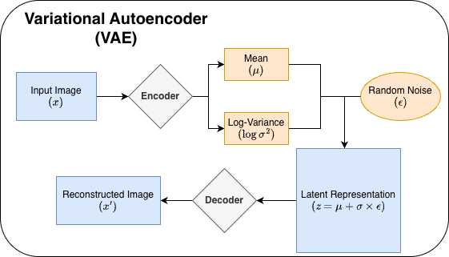
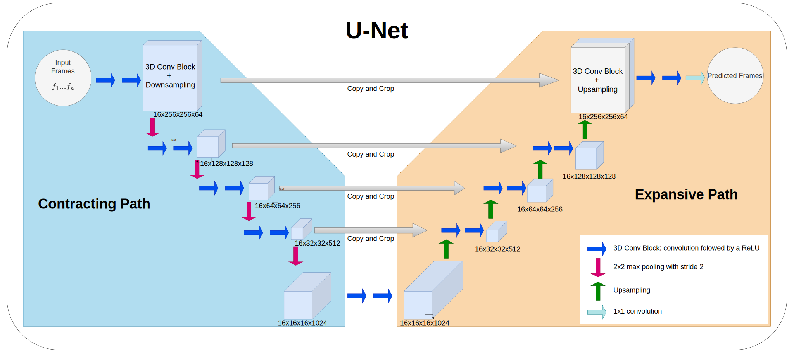
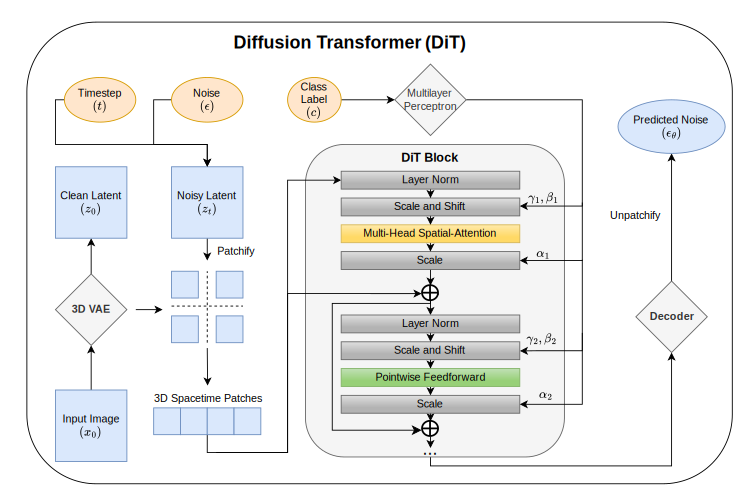
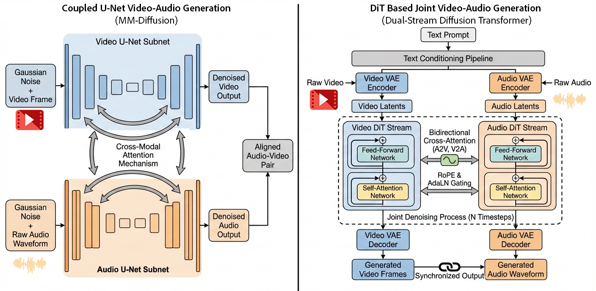
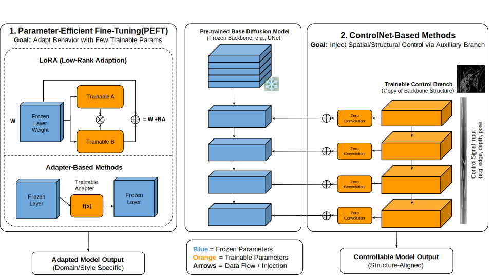

# 🎬 Multimodal Video Generation Models with Audio: Present and Future

[](https://arxiv.org)
[](https://awesome.re)
[](https://opensource.org/licenses/MIT)

> **Abstract:** Video generation models have advanced rapidly and are now widely used across entertainment, advertising, filmmaking, and robotics applications such as world modeling and simulation. However, visual content alone is often insufficient for realistic and engaging media experiences—audio is a key component of immersion and semantic coherence. As AI-generated videos become increasingly prevalent in everyday content, demand has grown for systems that can generate synchronized sound alongside visuals. This trend has driven rising interest in **multimodal video generation**, which jointly models video and audio to produce more complete, coherent, and appealing outputs.

---

## 📖 Table of Contents

- [0. 📚 Citation](#0--citation)
- [1. ✨ Representative Models](#1--representative-models)
- [2. 🏗️ Architectures & Evolution](#2--architectures--evolution)
  - [2.1 Variational Autoencoder (VAE)](#21-variational-autoencoder-vae)
  - [2.2 U-Net Architectures](#22-u-net-architectures)
  - [2.3 Diffusion Transformer (DiT)](#23-diffusion-transformer-dit)
  - [2.4 Future: Mixture of Experts (MoE) & Autoregressive](#24-future-mixture-of-experts-moe--autoregressive)
    - [2.4.1 Mixture of Experts (MoE)](#241-mixture-of-experts-moe)
    - [2.4.2 Autoregressive Generation](#242-autoregressive-generation)
- [3. ⚙️ Post-Training & Alignment](#3--post-training--alignment)
  - [3.1 Training-Free Audio-Visual Generation](#31-training-free-audio-visual-generation)
  - [3.2 Parameter-Efficient Fine-Tuning (PEFT)](#32-parameter-efficient-fine-tuning-peft)
  - [3.3 Audio-Visual Alignment Modules](#33-audio-visual-alignment-modules)
  - [3.4 Attention Injection & ControlNet](#34-attention-injection--controlnet)
- [4. 📊 Evaluation](#4--evaluation)
  - [4.1 Quantitative Evaluation](#41-quantitative-evaluation)
    - [4.1.1 Video Quality Metrics](#411-video-quality-metrics)
    - [4.1.2 Audio Quality Metrics](#412-audio-quality-metrics)
    - [4.1.3 Audio-Visual Alignment Metrics](#413-audio-visual-alignment-metrics)
  - [4.2 Qualitative Evaluation](#42-qualitative-evaluation)
- [5. 🚀 Applications and New Research Directions](#5--applications-and-new-research-directions)
  - [5.1 Personal User Applications](#51-personal-user-applications)
  - [5.2 Commercial Applications of Video Generation](#52-commercial-applications-of-video-generation)
- [6. 🔬 Active Research Areas in Multimodal Video Generation](#6--active-research-areas-in-multimodal-video-generation)
  - [6.1 Video-to-Audio Generation](#61-video-to-audio-generation)
  - [6.2 Streaming Multimodal Video Generation](#62-streaming-multimodal-video-generation)
  - [6.3 Human-Centric Multimodal Video Generation](#63-human-centric-multimodal-video-generation)
  - [6.4 Long Multimodal Video Generation](#64-long-multimodal-video-generation)
  - [6.5 Interactive Multimodal Video Generation and World Models](#65-interactive-multimodal-video-generation-and-world-models)
- [7. ⚠️ Limitations & Challenges](#7-%EF%B8%8F-limitations--challenges)
  - [7.1 Evaluation](#71-evaluation)
  - [7.2 Model Efficient Deployment and Latency](#72-model-efficient-deployment-and-latency)
  - [7.3 Modality Fusion and Unified Generation](#73-modality-fusion-and-unified-generation)

---

## 0. 📚 Citation

If you find this survey useful for your research, please cite our work:

```bibtex
Coming soon
```

---

## 1. ✨ Representative Models

A summary of current state-of-the-art multimodal video diffusion models discussed in our survey.

<table>
  <thead>
    <tr>
      <th align="left">Model / System</th>
      <th align="left">Architecture</th>
      <th align="left">Key Features</th>
      <th align="left">Release</th>
    </tr>
  </thead>
  <tbody>
    <tr style="background-color: #f6f8fa;">
      <td colspan="4"><b>Proprietary Business Models</b></td>
    </tr>
    <tr>
      <td><a href="[https://deepmind.google/models/veo/](https://seedance2.ai)"><b>SeedDance 2.0</b></a></td>
      <td>-</td>
      <td>Native audiovisual synthesis</td>
      <td>Feb 2026</td>
    </tr>
    <tr>
      <td><a href="https://deepmind.google/models/veo/"><b>Google Veo 3.1</b></a></td>
      <td>Diffusion + Sync Audio</td>
      <td>Native audiovisual synthesis</td>
      <td>May 2025</td>
    </tr>
    <tr>
      <td><a href="https://openai.com/index/sora-2/"><b>OpenAI Sora 2</b></a></td>
      <td>DiT (Enhanced)</td>
      <td>Improved temporal coherence; native audio sync</td>
      <td>Sep 2025</td>
    </tr>
    <tr>
       <td><a href="https://grok.com/imagine"><b>Grok 4</b></a></td>
      <td>-</td>
      <td>-</td>
      <td>July 2025</td>
    </tr>
    <tr>
      <td><a href="https://www.xrmm.com/"><b>Wan 2.6</b></a></td>
      <td>MoE DiT + MM Transformer</td>
      <td>Simultaneous audio-visual generation</td>
      <td>Dec 2025</td>
    </tr>
    <tr>
      <td><a href="https://klingai.com/global/"><b>Kling 2.6</b></a></td>
      <td>DiT + MM Transformer</td>
      <td>Simultaneous audio-visual generation</td>
      <td>Dec 2025</td>
    </tr>
    <tr style="background-color: #f6f8fa;">
      <td colspan="4"><b>Open-Source Models</b></td>
    </tr>
    <tr>
      <td><a href="https://github.com/researchmm/MM-Diffusion"><b>MM-Diffusion</b></a> <sup>†</sup></td>
      <td>Decoupled U-Net</td>
      <td>Early joint generation foundation model</td>
      <td>2023</td>
    </tr>
    <tr>
      <td><a href="https://huggingface.co/spaces/akhaliq/Ovi"><b>OVI</b></a> <sup>†</sup></td>
      <td>DiT + Sync Audio-Video</td>
      <td>Native 4K @ 50fps; open-source foundation</td>
      <td>Oct 2025</td>
    </tr>
    <tr>
      <td><a href="https://huggingface.co/Lightricks/LTX-2"><b>LTX-2</b></a> <sup>†</sup></td>
      <td>DiT + Sync Audio-Video</td>
      <td>Native 4K @ 50fps; open-source foundation</td>
      <td>Jan 2026</td>
    </tr>
  </tbody>
</table>

<p align="left">
  <sub><sup>†</sup> <em>Denotes Open-Source Models</em></sub>
</p>

<div align="center">
  
  <br>
  <em>Figure 1: Overview of Multimodal Video Generation Application Scenarios, illustrating key use cases across Social Media, Production, and Gaming.</em>
</div>

---

## 2. 🏗️ Architectures & Evolution

Multimodal video generation requires synchronizing distinct modalities (visual frames and audio waveforms) within a unified architecture. We trace the evolution from foundational VAEs to modern DiT and MoE architectures. Below is a comprehensive categorization of the models and papers referenced in our survey.

### 2.1 Variational Autoencoder (VAE)

VAEs establish a probabilistic mapping between input data and a latent space. In modern multimodal systems, they primarily serve as **compression mechanisms** (Video VAE & Audio VAE) to transform high-dimensional raw data into compact latent representations.

**Video VAE**: Uses 3D Causal CNNs to compress video frames while maintaining temporal consistency.
**Audio VAE**: Converts audio (often via Mel Spectrograms) into latent codes.
**Separate Encoders**: Systems like MM-Diffusion and OVI use separate encoders for each modality to handle their distinct characteristics.

| Paper / Model                                                                                  | Category            | Year | Key Contribution                                        |
| :--------------------------------------------------------------------------------------------- | :------------------ | :--- | :------------------------------------------------------ |
| [**Auto-Encoding Variational Bayes**](https://arxiv.org/abs/1312.6114)                         | **Foundational**    | 2013 | Introduces VAEs: probabilistic mapping to latent space. |
| [**Reducing the dimensionality of data**](https://www.science.org/doi/10.1126/science.1127647) | **Foundational**    | 2006 | Traditional autoencoders mapping to fixed vectors.      |
| [**MM-Diffusion (VAE Usage)**](https://arxiv.org/abs/2305.14458)                               | **Video/Audio VAE** | 2023 | Uses separate VAE encoders for video and audio streams. |

<div align="center">
  
  <br>
  <em>Figure 2: The Variational Autoencoder (VAE) architecture, which serves as the fundamental compression mechanism for encoding high-dimensional video and audio data into compact latent representations.</em>
</div>

### 2.2 U-Net Architectures

Diffusion models reverse a gradual noising process. Early architectures relied on **U-Nets** with skip connections. While foundational, the locality of convolutional operations limits their scalability for long-sequence multimodal tasks.

**Coupled U-Net**: Used in MM-Diffusion, where two parallel U-Net subnets (one for video, one for audio) jointly denoise signals, communicating via cross-attention.

| Paper / Model                                                         | Category             | Year | Key Contribution                                                  |
| :-------------------------------------------------------------------- | :------------------- | :--- | :---------------------------------------------------------------- |
| [**DDPM**](https://arxiv.org/abs/2006.11239)                          | **Foundational**     | 2020 | Core framework for training generative models via denoising.      |
| [**Diffusion Models Beat GANs**](https://arxiv.org/abs/2105.05233)    | **Foundational**     | 2021 | Demonstrates diffusion superiority in image synthesis.            |
| [**Video Diffusion Models**](https://arxiv.org/abs/2204.03458)        | **Foundational**     | 2022 | Extends diffusion to video domain.                                |
| [**Imagen Video**](https://arxiv.org/abs/2210.02303)                  | **Foundational**     | 2022 | High-definition video generation using cascaded diffusion models. |
| [**DDIM**](https://arxiv.org/abs/2010.02502)                          | **Foundational**     | 2022 | Accelerates sampling for diffusion models.                        |
| [**Latent Diffusion Models (LDM)**](https://arxiv.org/abs/2112.10752) | **Foundational**     | 2022 | Performs diffusion in compressed latent space for efficiency.     |
| [**U-Net**](https://arxiv.org/abs/1505.04597)                         | **U-Net Backbone**   | 2015 | Original encoder-decoder architecture with skip connections.      |
| [**MM-Diffusion**](https://arxiv.org/abs/2305.14458)                  | **Coupled U-Net**    | 2023 | Coupled U-Nets for joint video-audio denoising.                   |
| [**MM-LDM**](https://arxiv.org/abs/2401.03048)                        | **Latent U-Net**     | 2024 | Multi-modal latent diffusion in shared semantic space.            |
| [**Diff-Foley**](https://arxiv.org/abs/2306.11764)                    | **Audio-Visual**     | 2023 | Synchronized video-to-audio synthesis with LDMs.                  |
| [**AudioLDM**](https://arxiv.org/abs/2301.12503)                      | **Audio-Visual**     | 2023 | Text-to-audio generation using LDMs and CLAP.                     |
| [**Align Your Latents**](https://arxiv.org/abs/2304.08818)            | **Latent Alignment** | 2023 | High-resolution video synthesis with latent diffusion.            |
| [**MSF**](https://arxiv.org/abs/2501.13349)                           | **Optimization**     | 2025 | Efficient diffusion via multi-scale latent factorization.         |

<div align="center">
  
  <br>
  <em>Figure 3: The U-Net architecture, featuring encoder-decoder paths with skip connections, which formed the backbone of early joint video-audio diffusion models such as MM-Diffusion.</em>
</div>

### 2.3 Diffusion Transformer (DiT)

The current industry standard. DiT replaces U-Net with **Transformer** blocks, enabling better scalability and global spatiotemporal reasoning.

**Dual-Stream Fusion**: Modern systems (OVI, LTX-2) use dual-stream transformers where video and audio tokens are processed in parallel.
**Cross-Modal Attention**: A2V (Audio-to-Video) and V2A (Video-to-Audio) attention layers allow bidirectional communication, ensuring synchronization.
**Native Audio-Visual Synthesis**: Unlike previous pipeline approaches, models like OVI and LTX-2 generate both modalities simultaneously from scratch.

| Paper / Model                                                     | Category              | Year | Key Contribution                                               |
| :---------------------------------------------------------------- | :-------------------- | :--- | :------------------------------------------------------------- |
| [**Scalable Diffusion Models**](https://arxiv.org/abs/2212.09748) | **Core Architecture** | 2023 | Introduces DiT: Transformers as diffusion backbones.           |
| [**DiT (ICCV)**](https://arxiv.org/abs/2212.09748)                | **Core Architecture** | 2023 | Scalable Diffusion Models with Transformers (Conference).      |
| [**Attention Is All You Need**](https://arxiv.org/abs/1706.03762) | **Core Architecture** | 2017 | Foundational Transformer architecture with self-attention.     |
| [**Latte**](https://arxiv.org/abs/2401.03048)                     | **Video DiT**         | 2024 | Latent Diffusion Transformer specialized for video generation. |
| [**OVI**](https://aaxwaz.github.io/Ovi)                           | **Multimodal DiT**    | 2025 | Twin backbone cross-modal fusion for native AV generation.     |
| [**LTX-2**](https://github.com/Lightricks/LTX-Video)              | **Multimodal DiT**    | 2026 | Efficient joint audio-visual foundation model (Native 4K).     |
| [**MMAudio**](https://hkchengrex.github.io/MMAudio)               | **Multimodal DiT**    | 2025 | Taming multimodal joint training for high-quality synthesis.   |
| [**T5**](https://arxiv.org/abs/1910.10683)                        | **Conditioning**      | 2020 | Text-to-text transfer transformer used for text encoding.      |
| [**CLIP**](https://arxiv.org/abs/2103.00020)                      | **Conditioning**      | 2021 | Contrastive language-image pretraining for semantic alignment. |
| [**RoFormer (RoPE)**](https://arxiv.org/abs/2104.09864)           | **Positional Enc.**   | 2024 | Rotary Position Embedding for temporal alignment.              |

<div align="center">
  
  
  <br>
  <em>Figure 4: The Diffusion Transformer (DiT) paradigm. Top: The standard DiT block structure. Bottom: The architectural evolution from U-Nets to Native Audio-Visual DiTs employing Dual-Stream Fusion for simultaneous generation.</em>
</div>

### 2.4 Future: Mixture of Experts (MoE) & Autoregressive

To scale to billions of parameters efficiently and unify modalities, architectures are evolving towards **Mixture of Experts (MoE)** and **Autoregressive (AR)** paradigms.

#### 2.4.1 Mixture of Experts (MoE)

MoE introduces sparse activation, where only a subset of parameters (experts) is activated for a given input.

- **Token-level MoE**: Routes individual tokens to experts (e.g., SegMoE, Race-DiT).
- **Timestep-level MoE**: Assigns experts to different diffusion noise phases (e.g., Wan 2.6 uses high-noise vs. low-noise experts).

| Paper / Model                                                              | Category             | Year | Key Contribution                                                |
| :------------------------------------------------------------------------- | :------------------- | :--- | :-------------------------------------------------------------- |
| [**Wan 2.6**](https://www.xrmm.com/)                                       | **Timestep MoE**     | 2025 | Large-scale MoE DiT for video generation.                       |
| [**Cosmos World**](https://arxiv.org/abs/2501.03575)                       | **World Model**      | 2025 | Foundation model platform for physical AI with MoE.             |
| [**Outrageously Large Neural Networks**](https://arxiv.org/abs/1701.06538) | **Foundational MoE** | 2017 | Introduces sparsely-gated Mixture-of-Experts layer.             |
| [**GShard**](https://arxiv.org/abs/2006.16668)                             | **Foundational MoE** | 2020 | Scaling giant models with conditional computation.              |
| [**Switch Transformers**](https://arxiv.org/abs/2101.03961)                | **Foundational MoE** | 2022 | Scaling to trillion parameters with simple sparsity.            |
| [**Scaling Vision with Sparse MoE**](https://arxiv.org/abs/2106.05974)     | **Vision MoE**       | 2021 | Applying MoE to vision tasks.                                   |
| [**Uni-MoE**](https://arxiv.org/abs/2405.11273)                            | **Multimodal MoE**   | 2025 | Scaling unified multimodal LLMs with MoE.                       |
| [**DeepSeekMoE**](https://arxiv.org/abs/2401.06066)                        | **LLM MoE**          | 2024 | Ultimate expert specialization in MoE language models.          |
| [**SegMoE**](https://arxiv.org/abs/2601.21641)                             | **Token MoE**        | 2026 | Multi-resolution segment-wise MoE for efficient generation.     |
| [**Race-DiT**](https://arxiv.org/abs/2503.16057)                           | **Token MoE**        | 2025 | Flexible routing for improved sample quality and reduced FLOPs. |

#### 2.4.2 Autoregressive Generation

Autoregressive (AR) models process video and audio as sequential tokens, enabling unified understanding and generation in a single pass. While diffusion currently dominates high-fidelity generation, AR offers a path to unified multimodal "Any-to-Any" models.

| Paper / Model                                         | Category       | Year | Key Contribution                                                    |
| :---------------------------------------------------- | :------------- | :--- | :------------------------------------------------------------------ |
| [**Unified-IO 2**](https://arxiv.org/abs/2312.17172)  | **Unified AR** | 2023 | First autoregressive model to handle text, image, audio, and video. |
| [**BAGEL**](https://arxiv.org/abs/2505.14683)         | **Unified AR** | 2025 | Unified framework for multimodal understanding and generation.      |
| [**EMMA**](https://arxiv.org/abs/2512.04810)          | **Unified AR** | 2025 | Efficient multimodal model for video and audio understanding.       |
| [**Janus Pro**](https://github.com/deepseek-ai/Janus) | **Unified AR** | 2025 | Decoupled visual encoding for unified multimodal generation.        |
| [**SpecVQGAN**](https://arxiv.org/abs/2104.04415)     | **Early AR**   | 2021 | Autoregressive generation of audio spectrograms from video.         |
| [**Im2Wav**](https://arxiv.org/abs/2211.14503)        | **Early AR**   | 2023 | Image-guided audio generation using autoregressive transformers.    |

---

## 3. ⚙️ Post-Training & Alignment

While large-scale pretraining establishes the foundation for multimodal generation, post-training techniques are essential for adapting models to specific tasks, improving audio-visual alignment, and enabling fine-grained control. These methods allow for efficient adaptation without the massive computational cost of full retraining.

### 3.1 Training-Free Audio-Visual Generation

Training-free methods leverage the inherent capabilities of pretrained models (e.g., attention mechanisms) to guide generation. These approaches often manipulate attention maps or use optimization-based guidance during inference to enforce synchronization between audio and video modalities.

| Paper / Model                                               | Category               | Year | Key Contribution                                                                                                    |
| :---------------------------------------------------------- | :--------------------- | :--- | :------------------------------------------------------------------------------------------------------------------ |
| [**Diff-Foley**](https://arxiv.org/abs/2306.17203)          | **Optimization**       | 2023 | Uses Contrastive Audio-Video Pretraining (CAVP) to guide latent diffusion for synchronized audio generation.        |
| [**Seeing and Hearing**](https://arxiv.org/abs/2402.17723)  | **Attention Guidance** | 2024 | Utilizes a pretrained ImageBind encoder to guide generation, ensuring semantic consistency between modalities.      |
| [**Guidance-Based Sync**](https://arxiv.org/abs/2507.01603) | **Sampling Guidance**  | 2025 | Modifies flow matching or diffusion loss during sampling to bias generation toward audio-aligned temporal patterns. |

### 3.2 Parameter-Efficient Fine-Tuning (PEFT)

PEFT techniques adapt large pretrained models to new domains or tasks by updating only a small fraction of parameters. This is crucial for multimodal generation where full fine-tuning is prohibitively expensive.

| Paper / Model                                          | Category             | Year | Key Contribution                                                                                                                |
| :----------------------------------------------------- | :------------------- | :--- | :------------------------------------------------------------------------------------------------------------------------------ |
| [**LoRA**](https://arxiv.org/abs/2106.09685)           | **Adaptation**       | 2022 | Low-Rank Adaptation: Injects trainable low-rank matrices into attention layers, reducing trainable parameters by up to 10,000x. |
| [**AV-DiT**](https://arxiv.org/abs/2406.07686)         | **PEFT Application** | 2024 | Applies LoRA to audio-visual DiT models, enabling efficient adaptation for synchronized generation tasks.                       |
| [**Adapter Layers**](https://arxiv.org/abs/1902.00751) | **Adaptation**       | 2019 | Inserts lightweight adapter modules between transformer blocks to learn modality-specific features.                             |

### 3.3 Audio-Visual Alignment Modules

Specialized modules designed to explicitly model and enforce synchronization between audio waveforms and visual motion. These are often plug-and-play components added to existing backbones.

| Paper / Model                                                  | Category               | Year | Key Contribution                                                                                                    |
| :------------------------------------------------------------- | :--------------------- | :--- | :------------------------------------------------------------------------------------------------------------------ |
| [**FoleyCrafter**](https://github.com/open-mmlab/FoleyCrafter) | **Parallel Attention** | 2024 | Integrates parallel cross-attention layers alongside text-based attention to condition audio on video features.     |
| [**Syncphony**](https://syncphony.github.io)                   | **Cross-Attention**    | 2025 | Injects audio features via cross-attention with RoPE to enable precise audio-motion alignment on DiT architectures. |
| [**Synchformer**](https://arxiv.org/abs/2402.13258)            | **Sync Detection**     | 2024 | A hierarchical transformer for detecting audio-visual desynchronization at millisecond-level precision.             |
| [**AuTo-Video**](https://arxiv.org/abs/2501.13349)             | **Temporal Loss**      | 2025 | Introduces onset-aware temporal loss functions to penalize misalignment between audio beats and visual motion.      |

### 3.4 Attention Injection & ControlNet

These methods introduce additional control pathways to guide the generation process, allowing for spatial and temporal structural control based on external signals (e.g., depth maps, pose, or audio amplitude).

| Paper / Model                                                             | Category               | Year | Key Contribution                                                                                                      |
| :------------------------------------------------------------------------ | :--------------------- | :--- | :-------------------------------------------------------------------------------------------------------------------- |
| [**ControlNet**](https://arxiv.org/abs/2302.05543)                        | **Structural Control** | 2023 | Adds trainable copies of encoder blocks to inject spatial conditions (edges, depth) into diffusion models.            |
| [**Temporal ControlNet**](https://huggingface.co/CiaraRowles/TemporalNet) | **Video Control**      | 2024 | Extends ControlNet to the temporal dimension, using timestamp masks to align video frames with specific audio events. |
| [**MTV**](https://arxiv.org/abs/2506.08003)                               | **Multi-Stream**       | 2025 | Multi-Stream Temporal ControlNet: Uses dedicated encoders for audio, video, and text to achieve fine-grained control. |

<div align="center">
  
  <br>
  <em>Figure 5: A Taxonomy of Post-Training and Alignment Methods, categorizing approaches into Training-Free Guidance, Parameter-Efficient Fine-Tuning (PEFT), Alignment Modules, and Attention Injection.</em>
</div>

---

## 4. 📊 Evaluation

Evaluating joint video-audio generation is complex, requiring assessments of video quality, audio quality, and cross-modal alignment. Common practices involve both quantitative metrics and qualitative human evaluation.

<div align="center">
  
  <br>
  <em>Figure 6: A Comprehensive Multimodal Evaluation Framework, detailing Quantitative metrics (Video Quality, Audio Quality, Alignment) and Qualitative Human Evaluation protocols.</em>
</div>

### 4.1 Quantitative Evaluation

Quantitative evaluation assesses each modality independently as well as their cross-modal alignment.

#### 4.1.1 Video Quality Metrics

| Metric / Benchmark                                                           | Category         | Year | Key Contribution                                                                     |
| :--------------------------------------------------------------------------- | :--------------- | :--- | :----------------------------------------------------------------------------------- |
| [**FVD**](https://openreview.net/pdf?id=rylgEULtdN) (Fréchet Video Distance) | **Distribution** | 2019 | Reference-based metric measuring distribution distance using I3D features.           |
| [**CLIPScore**](https://arxiv.org/abs/2104.08718)                            | **Semantic**     | 2021 | Reference-free metric measuring text-video semantic alignment.                       |
| [**VBench**](https://vbench.github.io)                                       | **Benchmark**    | 2023 | Fine-grained evaluation across dimensions like Dynamic Degree and Aesthetic Quality. |
| [**VBench++**](https://github.com/Vchitect/VBench)                           | **Benchmark**    | 2025 | Extends VBench to image-to-video and model trustworthiness assessment.               |
| [**VBench-2.0**](https://arxiv.org/abs/2503.21755)                           | **Benchmark**    | 2025 | Introduces physics-based realism, commonsense reasoning, and human fidelity.         |

#### 4.1.2 Audio Quality Metrics

| Metric / Benchmark                                                   | Category         | Year | Key Contribution                                                             |
| :------------------------------------------------------------------- | :--------------- | :--- | :--------------------------------------------------------------------------- |
| [**FAD**](https://arxiv.org/abs/1812.08466) (Fréchet Audio Distance) | **Distribution** | 2019 | Compares generated and reference audio distributions using VGGish features.  |
| [**KAD**](https://arxiv.org/abs/2306.01427) (Kernel Audio Distance)  | **Distribution** | -    | MMD-based approach addressing FAD's Gaussian assumption limitations.         |
| [**CLAP Score**](https://arxiv.org/abs/2211.06687)                   | **Alignment**    | 2023 | Measures text-audio alignment via cosine similarity in CLAP embedding space. |
| [**PAM**](https://arxiv.org/abs/2402.13258)                          | **Prompting**    | 2024 | Prompt Adherence Metric using Audio-Language Models.                         |
| [**Audiobox Aesthetics**](https://arxiv.org/abs/2312.11325)          | **Quality**      | 2023 | Decomposes quality into axes like Production Quality and Content Enjoyment.  |
| [**MAD**](https://arxiv.org/abs/2212.10426)                          | **Distribution** | -    | MAUVE Audio Divergence, a non-Gaussian alternative to FAD.                   |

#### 4.1.3 Audio-Visual Alignment Metrics

| Metric / Benchmark                                       | Category         | Year | Key Contribution                                                           |
| :------------------------------------------------------- | :--------------- | :--- | :------------------------------------------------------------------------- |
| [**AV-Align**](https://arxiv.org/abs/2305.14458)         | **Semantic**     | 2023 | Measures semantic correspondence between audio and video streams.          |
| [**DeSync**](https://arxiv.org/abs/2402.13258)           | **Temporal**     | 2024 | Quantifies temporal misalignment using the Synchformer model.              |
| [**ImageBind Score**](https://arxiv.org/abs/2305.05665)  | **Alignment**    | 2023 | Computes cosine similarity in ImageBind's joint embedding space.           |
| [**FAVD**](https://arxiv.org/abs/2101.08779)             | **Distribution** | 2019 | Extends Fréchet distance to joint audio-visual features.                   |
| [**Spatial AV-Align**](https://arxiv.org/abs/2301.xxxxx) | **Spatial**      | 2023 | Evaluates spatial coherence using object detection and sound localization. |

### 4.2 Qualitative Evaluation

Human evaluation remains essential for capturing perceptual synchronization and semantic coherence.

| Paradigm                                                | Description                                                              | Key Aspects                                            |
| :------------------------------------------------------ | :----------------------------------------------------------------------- | :----------------------------------------------------- |
| **Overall Preference (MOS)**                            | Annotators rate overall quality or select the better sample (1-5 scale). | Combined audiovisual experience.                       |
| **Multi-Aspect Scoring**                                | Quality decomposed into modality-specific and cross-modal dimensions.    | Visual Fidelity, Audio Quality, AV Sync.               |
| [**PEAVS Framework**](https://arxiv.org/abs/2404.07336) | Comprehensive protocol for perceptual evaluation of synchrony.           | Temporal offsets, speed variations, content alignment. |

---

## 5. 🚀 Applications and New Research Directions

With the emerging capabilities of joint video-audio generation models, multimodal content creation is entering a new phase where visual and auditory elements are produced synchronously. This shift moves beyond silent video to **native audiovisual synthesis**, driven by proprietary models like **Sora 2**, **Veo 3.1**, and **Wan 2.6**.

<div align="center">
  
  <br>
  <em>Figure 7: The Landscape of Applications and Active Research Areas, highlighting the expansion from Personal and Commercial applications to frontier topics like World Models and Long Video Generation.</em>
</div>

### 5.1 Personal User Applications

Personal applications focus on social media content creation, entertainment, and personalized avatar interaction.

| Paper / Model                                                 | Category     | Year | Key Contribution                                                                        |
| :------------------------------------------------------------ | :----------- | :--- | :-------------------------------------------------------------------------------------- |
| [**Sora 2**](https://openai.com/index/sora-2/)                | Social Media | 2025 | Generates synchronized dialogue, Foley, and ambient audio; includes social sharing app. |
| [**Doubao**](https://www.doubao.com/)                         | Social Media | 2025 | Integrated audio-visual generation for short clips on TikTok.                           |
| [**Kling AI**](https://klingai.com/)                          | Social Media | 2025 | Text-to-video with integrated audio capabilities.                                       |
| [**Hallo**](https://github.com/fudan-generative-vision/hallo) | Avatar       | 2024 | Audio-driven portrait animation with natural lip sync.                                  |
| [**EchoMimic**](https://github.com/BadToBest/EchoMimic)       | Avatar       | 2024 | Identity-preserving audio-driven avatar generation.                                     |
| [**OmniHuman-1**](https://omni-human.github.io)               | Avatar       | 2025 | Full-body audio-driven animation with expressive gestures and singing.                  |

### 5.2 Commercial Applications of Video Generation

Commercial adoption spans advertising, film production, and gaming, leveraging native audio to reduce post-production overhead.

| Paper / Model                                           | Category      | Year | Key Contribution                                                                           |
| :------------------------------------------------------ | :------------ | :--- | :----------------------------------------------------------------------------------------- |
| [**Movie Gen**](https://ai.meta.com/research/movie-gen) | Entertainment | 2024 | Personalizes video generation for users; precise editing and sound design.                 |
| [**Runway**](https://runwayml.com/)                     | Film & TV     | 2023 | Professional tools for video editing, in-painting, and style transfer.                     |
| [**Luma**](https://lumalabs.ai/dream-machine)           | Gaming        | 2024 | 3D capture and video generation for game assets and environments.                          |
| [**Pika**](https://pika.art/)                           | Marketing     | 2023 | Animation of static images and text-to-video for marketing materials.                      |
| [**VEO**](https://deepmind.google/models/veo/)          | Enterprise    | 2024 | High-fidelity video generation for enterprise use cases, integrated into Google Workspace. |

## 6. 🔬 Active Research Areas in Multimodal Video Generation

Research is expanding into specialized domains to address challenges in synchronization, streaming, and physical simulation.

### 6.1 Video-to-Audio Generation

Synthesizing temporally and semantically aligned audio from video inputs.

| Paper / Model                                                  | Category  | Year | Key Contribution                                                                  |
| :------------------------------------------------------------- | :-------- | :--- | :-------------------------------------------------------------------------------- |
| [**Diff-Foley**](https://github.com/luoscial/Diff-Foley)       | V2A       | 2024 | Latent diffusion with Contrastive Audio-Video Pretraining (CAVP).                 |
| [**MMAudio**](https://hkchengrex.github.io/MMAudio/)           | V2A       | 2025 | Joint training with conditional synchronization module for video-audio alignment. |
| [**MM-Diffusion**](https://github.com/researchmm/MM-Diffusion) | Joint Gen | 2022 | Coupled U-Net with randomly shifted attention for cross-modal consistency.        |
| [**AV-DiT**](https://arxiv.org/abs/2501.13349)                 | Joint Gen | 2025 | Adapts pretrained DiT with modality-specific adapters for joint generation.       |
| [**UniForm**](https://arxiv.org/abs/2501.xxxxx)                | Joint Gen | 2025 | Unified single-tower DiT processing concatenated audio-video tokens.              |

### 6.2 Streaming Multimodal Video Generation

Real-time generation with strict latency constraints for live applications.

| Paper / Model                                                           | Category        | Year | Key Contribution                                                                 |
| :---------------------------------------------------------------------- | :-------------- | :--- | :------------------------------------------------------------------------------- |
| [**CausVid**](https://arxiv.org/abs/2501.xxxxx)                         | Causal Modeling | 2025 | Causal autoregressive transformer distilled from bidirectional DiT.              |
| [**MotionStream**](https://arxiv.org/abs/2501.xxxxx)                    | Causal Modeling | 2025 | Interactive streaming with sliding-window causal attention and KV cache rolling. |
| [**StreamDiffusion**](https://github.com/cumulo-autumn/StreamDiffusion) | Real-time       | 2025 | Real-time diffusion pipeline optimized for interactive generation.               |

### 6.3 Human-Centric Multimodal Video Generation

Focuses on realistic talking heads, pose animation, and customization.

| Paper / Model                                           | Category       | Year | Key Contribution                                                   |
| :------------------------------------------------------ | :------------- | :--- | :----------------------------------------------------------------- |
| [**MultiTalk**](https://github.com/Kedreamix/MultiTalk) | Face Animation | 2025 | Maps speech signals to mouth shapes and facial motion.             |
| [**InfiniteTalk**](https://arxiv.org/abs/2508.14033)    | Face Animation | 2025 | Infinite-length talking head generation addressing temporal drift. |
| [**Wan-Animate**](https://wan-video.com)                | Pose Animation | 2025 | Maps target poses to realistic human videos.                       |
| [**HuMo**](https://arxiv.org/abs/2501.xxxxx)            | Customization  | 2025 | Controllable identity transfer for video generation.               |
| [**MMSonate**](https://arxiv.org/abs/2601.01568)        | Customization  | 2026 | Consistent audio-visual identity control across generated content. |

### 6.4 Long Multimodal Video Generation

Maintaining coherence over minutes to unbounded lengths.

| Paper / Model                                            | Category    | Year | Key Contribution                                                   |
| :------------------------------------------------------- | :---------- | :--- | :----------------------------------------------------------------- |
| [**FramePack**](https://github.com/lllyasviel/FramePack) | Single-Shot | 2025 | Single-shot long video generation using packing techniques.        |
| [**StreamingT2V**](https://streamingt2v.github.io/)      | Single-Shot | 2025 | Autoregressive conditioning for consistent long-form video.        |
| [**HoloCine**](https://holo-cine.github.io/)             | Multi-Shot  | 2025 | Memory mechanisms for consistent narrative across video segments.  |
| [**VISTA**](https://g-vista.github.io/)                  | Agentic     | 2025 | Iterative planning and critique for long-horizon alignment.        |
| [**AutoMV**](https://arxiv.org/abs/2512.12196)           | Agentic     | 2025 | Coordinates agents (director, verifier) for coherent music videos. |

### 6.5 Interactive Multimodal Video Generation and World Models

Simulating physical environments and dynamics with audio-visual coherence.

| Paper / Model                                                       | Category      | Year | Key Contribution                                              |
| :------------------------------------------------------------------ | :------------ | :--- | :------------------------------------------------------------ |
| [**AV-CDiT**](https://arxiv.org/abs/2512.00883)                     | World Model   | 2025 | Action-conditioned AV dynamics simulation for embodied AI.    |
| [**GWM-1**](https://runwayml.com/research/introducing-runway-gwm-1) | World Model   | 2025 | General world model for explorable worlds and robotics.       |
| [**Movie Gen**](https://arxiv.org/abs/2410.13720)                   | World Model   | 2024 | Unified 30B video + 13B audio model for realistic simulation. |
| [**ELSA**](https://arxiv.org/abs/2409.11369)                        | Spatial Audio | 2024 | Spatially grounded text-audio embeddings for 3D localization. |
| [**ViSAGe**](https://jaeyeonkim99.github.io/visage/)                | Spatial Audio | 2025 | Synthesizes first-order ambisonics from silent video.         |

---

## 7. ⚠️ Limitations & Challenges

Despite rapid advancements, significant hurdles remain in achieving seamless, physically plausible, and efficient multimodal video generation.

### 7.1 Evaluation

| Paper / Model                                      | Challenge           | Year | Key Contribution                                                             |
| :------------------------------------------------- | :------------------ | :--- | :--------------------------------------------------------------------------- |
| [**FAD**](https://arxiv.org/abs/2502.15602)        | Metric Limitations  | 2025 | Reference-free metric for evaluating audio generation quality and diversity. |
| [**VABench**](https://arxiv.org/html/2512.09299v1) | Perceptual Mismatch | 2025 | Comprehensive Benchmark for Audio-Video Generation.                          |

### 7.2 Model Efficient Deployment and Latency

| Paper / Model                                    | Challenge             | Year | Key Contribution                                                                        |
| :----------------------------------------------- | :-------------------- | :--- | :-------------------------------------------------------------------------------------- |
| [**LiveTalk**](https://arxiv.org/abs/2512.23576) | Real-Time Interaction | 2025 | Real-time multimodal interactive video diffusion via improved on-policy distillation.   |
| [**MIDAS**](https://arxiv.org/abs/2508.19320)    | Real-Time Interaction | 2025 | Multimodal interactive digital-human synthesis via real-time autoregressive generation. |

### 7.3 Modality Fusion and Unified Generation

| Paper / Model                                                    | Challenge              | Year | Key Contribution                                                                       |
| :--------------------------------------------------------------- | :--------------------- | :--- | :------------------------------------------------------------------------------------- |
| [**Unified Multimodal Model**](https://arxiv.org/abs/2509.09666) | Unified Generation     | 2025 | Unified multimodal model as auto-encoder for synchronous generation and understanding. |
| [**Balanced Multimodal**](https://arxiv.org/abs/2509.02281)      | Modality Hallucination | 2025 | Unidirectional dynamic interaction perspective to mitigate modality hallucination.     |
| [**UniTok**](https://neurips.cc/virtual/2025/poster/116864)      | Unified Tokenization   | 2025 | Unified tokenizer for visual generation and understanding to reduce interference.      |
